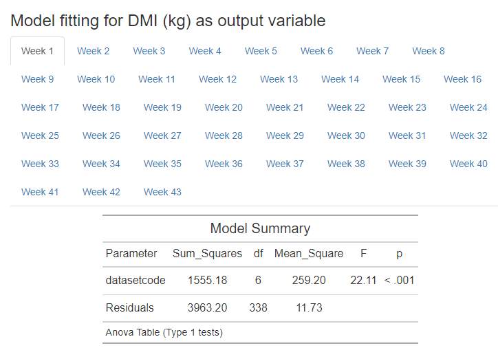

R markdown is an excellent way to share your work, results and code with peers and supervisors. You can streamline text, headers, tables, code, objects and model outputs into a neatly formatted document for export as HTML or PDF. I regularly condense updates and progress on my research thesis into HTML files to share with my major professor. It lets me explain my thought process, add the code I wrote, and display the output immediately in an organized fashion to guide our meetings. I'm currently using R markdown to create this story.

An issue I've run into when sharing many model outputs is that the neat document format can quickly become a giant sheet to scroll through, with pages of model output ad naseum, making it difficult to navigate. This led me to tabsets.

# Tabsets

Tabset is a HTML attribute that nests content into separate, clickable tabs. Instead of a document that extends vertically with each output, it nests similar results into tabs that are switched between by the reader, saving a large amount of screen real estate. Pictured is an example of a repeated measure variable (Dry Matter Intake for each week of lactation) that was analysed using an ANOVA model. Instead of printing each model summary chronologically, tabset allowed me to group the results by tabs for each week.



Tabset integrates natively with the header hierarchy of R Markdown, making it very easy to use. `{.tabset}` is entered at the end of the section header, then all headers a level below this initial header will create the tabs. This lets you create a section for your tabset, then name each tab with header syntax. Make sure you leave a blank space between each or your tabs won't separate, and to quit the tabset you need an empty line and a new header that is the same hierarchy as the tabset header.  

However if you want to use tabsets to compact a large volume of output, rather than set them up manually you can automatically name your tabs and generate them along with your output within a for loop. 

# For loops in R  

For loops are powerful programmatic iteration tools. You set a range that you want an operation performed over, and add explicit instructions for the operations to perform on each item across the range. But since R is already a functional programming language, for loops are commonly wrapped into other functions, or replaced entirely with the family of apply functions (`apply(), sapply(), lapply` etc) or map function from the purrr package. These two options allow easy mapping of a function across a range of values without needing to create a for loop, and speed up your computation time in the console. But for more detailed actions I use a for loop to generate all the model output I want to present, at each time points in a repeated measure, and nest each in a separate tab. This markdown setup requires a few specific elements and considerations, and will be the focus of this story.  

## Tabset setup  
I will start by creating a sample database. We will generate 100 cows with unique ID numbers, and assign them milk weight values in kilograms for multiple weeks of their lactation. These cows all come from different dairies so I will assign a dairy label (1 - 5), then tabulate it by dairy so we sum how many cows in each one.  

(These code chunks are created by fencing your r code with ``` {r} (code here) ```. I am setting `echo=TRUE` as an option so that the code is displayed in the markdown document, as well as the printed output such as the `head()` table and the `table()` table. `echo=TRUE` comes after the r in the fenced brackets {}, so your code chunk header will look like `{r, echo=TRUE}`)


```{r, echo=TRUE}
CowSample <- data.frame (CowID = c(sample(400:599, 100, replace=FALSE)),
                         Week1 = c(runif(100, min=10, max=20)),
                         Week2 = c(runif(100, min=15, max=25)),
                         Week3 = c(runif(100, min=18, max=28)),
                         dairy = c(sample(1:5, 100, replace=TRUE)))
head(CowSample) 
table(CowSample$dairy)
```

Now I want to analyse if the mean of milk production is different by week across the different dairies using an ANOVA model. I will print the model summary, a pairwise comparison of the means of each level, and a QQ plot of the residuals, testing for their normality.

First we need to set the dairy vector as a factor in the data.frame so that we can compare across its levels in the ANOVA. 

```{r, echo=TRUE}
CowSample$dairy <- as.factor(CowSample$dairy)
aov.week1 <- aov(Week1 ~ dairy, data=CowSample)
summary(aov.week1)
plot(aov.week1, which=2)
TukeyHSD(aov.week1)
```
   
We see the model is not significant, the mean of milk at Week 1 is not different across the 5 different dairies. I want to continue this analysis for each week and ask the same question. I could do this by writing out the same model code for each column, or I could have a for loop perform it across a column range. If I want to set each week up manually in a tabset I do this easily with markdown here by setting a header, then child headers for each tab. 

`## Milk analysis {.tabset}`  
`### Week 1`  
`(content here)`    
`### Week 2`       
`(content here)`    

## Milk analysis {.tabset}

### Week 1
```{r, echo=TRUE}
CowSample$dairy <- as.factor(CowSample$dairy)
aov.week1 <- aov(Week1 ~ dairy, data=CowSample)
summary(aov.week1)
plot(aov.week1, which=2)
TukeyHSD(aov.week1)
```
  
### Week 2
```{r, echo=TRUE}
CowSample$dairy <- as.factor(CowSample$dairy)
aov.week2 <- aov(Week2 ~ dairy, data=CowSample)
summary(aov.week2)
plot(aov.week2, which=2)
TukeyHSD(aov.week2)
```
  
## Exit the tabset
Remember we need a header of the same tier as the opener of the tabset to exit and make sure following content isn't stuck in the last tab.   

# Generate tab headings within the for loop
The previous approach is usable for a small number of tabs, or well defined content. But if we are looping a function over a large range we can set up some code to include the tabset headers within the for loop.  

This approach introduces a new code chunk option. Previously I set `echo=TRUE` in my chunk header after `{r}`, to specify that I want the code included in the HTML output. This time I will enable `results='asis'`. It is situated as other chunk options, after the language specification, separated by a comma ` ```{r, results='asis'}``` `. Normally knitr (the package that turns your R markdown file into HTML or PDF output) renders code verbatim and fences it within blocks on the document: 
`  
```
## print("Hello World")
```
`
But when we set `results='asis'` code will instead be output raw, without the fences. We can use this to our advantage when creating tabsets by creating raw output that is recognized as a subheader, and creates a tab in our tabset. To illustrate this I will create a variable for a numbered tabset header and print it in a for loop. Because code is output 'asis' and not fenced in code blocks the output will be picked up by a previously established tabset header with the {.tabset} attribute, and collected into tabs.

### Example tabset {.tabset}
``` {r,results='asis', echo=TRUE}
a <- 0
for (i in 1:10){
  a <- a + 1
  cat("#### Tab number", a, "\n")
  cat("\n")
  cat("This is tab number", a, "\n")
  cat("\n")
  print("Hello world \n")
  cat("\n")
  summary(aov.week1)
}
```

### New considerations
The code above is now looping through a variable of length 10. I set `a` as 0 before the for loop, and have it increase by 1 with each loop as a type of tally. I can directly call variables in my output, so I set `a` in the middle of the function naming each of my tabs. Notice how the `cat()` function wraps text output. Because we're using the `results=asis` chunk option code is output as raw markdown, if I want to output characters as I typed them it needs to go within `cat()`. I also need to use the `print()` function to get the output of function displayed under the `results=asis` option, otherwise nothing will be returned. You can see that I included `print("Hello world")` above and got code output, but `summary(aov.week1)` returned nothing, even though it would normally give me the model table output if `results=asis` were not turned on. Instead I would need to wrap it as `print(summary(aov.week1))`.    

Another consideration is the use of `"\n"`. You see above `"\n"` appearing liberally within the code. This is necessary to appease the formatting of the tabset header hierarchy. `"\n"` at the end of a line returns a line break, `cat("\n")` on a separate line gives me a blank line. When the for loop is returning the raw code output, without line breaks at the end of a statement, and an empty line between the subheaders and content the tabset formatting will be violated and it will not catch each subheader as a new tab input, as output will be joined together and not separated as new headings. 

## Including a model in a loop
Next I want to set up some model building across the range of columns I created earlier. Instead of rewriting the model equation every time, I can wrap it in a for loop and have this performed for me. I will build a for loop that iterates across the range of columns, and uses the column values as its model input. I'd also like to count each iteration, and save each model as a separate variable, instead of the result being replaced by a new iteration of the loop. To do this I will use the assign and paste functions. 

```{r, echo=TRUE}
b <- 0
for (i in CowSample[,2:4]){
  b <- b + 1
  model <- aov(i ~ dairy, data=CowSample)
  assign(paste0("Anova.", b), model, pos=1)
}
Anova.1
Anova.2
Anova.3
```

To loop my model function through each of the columns for week of milk I call the columns by index using `CowSample[,2:4]`, as week 1, 2 and 3 are at column index 2,3 and 4. the comma before 2:4 is essential as it indicates that we are indexing the columns, row index comes before column and they separated by a comma. Since we are including all rows and calling specific columns we don't include any variable before the comma.  

Again I am using the counter variable `b` here to assign numbered names to the output. With the `assign()` function I am changing the name of the `model` variable that is created in each loop to a unique identifier by adding the counter to the name with `paste0()`. This ensures that my environment saves a unique model for each run of the loop instead of replacing the previous one, as it would normally do. This is not necessary if I just want to print each model in a tab, but can be important if I want to save each model for later. 

# Printing model output in a looped tabset

Finally I will discuss some considerations for outputting model information in the tabset I described above. Since we need to use the `results=asis` for the tabset header to catch our tab names, some of our model description outputs will not work as expected within the chunk. I previously mentioned that functions need to be wrapped in the `print()` function, or they will not return anything. Lets try that now for `summary(model)`. 

#### ANOVA by week in milk with model summary {.tabset}
``` {r,results='asis', echo=TRUE}
c <- 0
for (i in CowSample[,2:4]){
  c <- c + 1
  cat("##### Week", c, "\n")
  cat("\n")
  cat("This is an ANOVA of milk by dairy for week", a, "\n")
  cat("\n")
  
  model <- aov(i ~ dairy, data=CowSample)
  
  current.model <-assign(paste0("Anova.", c), model, pos=1)
  print(summary(current.model))
  cat("\n")
}
```

#### Didn't work quite as expected
Don't forget the `cat("\n")` at the end or your tabs will all be conjoined into one. You can see the table for the model summary did not output as normal, and turned into an ugly mixup. I have two possible solutions for this.  

1. Use a HTML formatted table from the package parameters
2. Convert your output to a markdown table as a kable using Knitr   


## 1. Parameters package

The parameters package offers some attractive model summaries that can be printed natively in HTML, and fits with our chunk under the `results=asis` option. 

If you are including code for loading librarys in your markdown I recommend setting the code chunk options to `{r, warning=FALSE, message=FALSE}` so that any messages from the librarys are hidden from your output. 

```{r, message=FALSE, warning=FALSE}
#install.packages("parameters")
library(parameters)
```

Now I will rerun the previous for loop and try `print_html` with `model_parameters` from the parameters package.

#### ANOVA by week in milk with model output fixed {.tabset}
``` {r,results='asis', echo=TRUE}
c <- 0
for (i in CowSample[,2:4]){
  c <- c + 1
  cat("##### Week", c, "\n")
  cat("\n")
  cat("This is an ANOVA of milk by dairy for week", a, "\n")
  cat("\n")
  
  model <- aov(i ~ dairy, data=CowSample)
  
  current.model <-assign(paste0("Anova.", c), model, pos=1)
  print(print_html(model_parameters(current.model, summary=TRUE)))
  cat("\n")
}
```

#### Now we have a much more attractive and readable output with the HTML formatted summary table for this package.  

However, the tukey table I constructed earlier to examine the differences between each group is an object that doesn't fit with the `model_parameters' function. Instead I will use the tidyverse package to convert it to a markdown friendly kable.

## 2. Kables instead of tables
Earlier when I generated a tukey analysis we printed a table with the results. But the class of this object isn't easily manipulated.  

```{r, echo=TRUE}
CowSample$dairy <- as.factor(CowSample$dairy)
aov.week1 <- aov(Week1 ~ dairy, data=CowSample)
tukey <- TukeyHSD(aov.week1)
tukey
class(tukey)
```

When I try and output this under the `results=asis` option lets look at the result.

#### ANOVA by week in milk with tukey analysis {.tabset}
``` {r,results='asis', echo=TRUE}
c <- 0
for (i in CowSample[,2:4]){
  c <- c + 1
  cat("##### Week", c, "\n")
  cat("\n")
  cat("This is an ANOVA of milk by dairy for week", a, "\n")
  cat("\n")
  
  model <- aov(i ~ dairy, data=CowSample)
  
  current.model <-assign(paste0("Anova.", c), model, pos=1)
  print(TukeyHSD(current.model))
  cat("\n")
}
```

#### Didn't come out very legible. 
This time we'll take the tukey object and convert it to a tibble using the tidyverse package. Kables are a type of table from the Knitr package that make very simple tables for markdown rendering. By converting our tukey object to one of these maybe we can improve the readability.  

First I will `tidy()` the Tukey output to a data.frame using the broom package, and load the knitr package to use the `kable()` function. 

```{r, message=FALSE, warning=FALSE}
#install.packages("broom")
library(broom)
library(knitr)
```


#### ANOVA by week in milk with tukey Kable {.tabset}
``` {r,results='asis', echo=TRUE, message=FALSE, warning=FALSE}
c <- 0
for (i in CowSample[,2:4]){
  c <- c + 1
  cat("##### Week", c, "\n")
  cat("\n")
  cat("This is an ANOVA of milk by dairy for week", a, "\n")
  cat("\n")
  
  model <- aov(i ~ dairy, data=CowSample)
  
  current.model <-assign(paste0("Anova.", c), model, pos=1)
  tukey <- tidy(TukeyHSD(current.model))
  print(kable(tukey))
  cat("\n")
}
```


#### This time we managed to print a table with better formatting to interpret our tukey analysis.  
Unfortunately the data.frame conversion introduced some unnecessary columns and titles. We can clean this up with some kable formatting by adding options from the "kableExtra" package. I will exclude the unhelpful columns using `select()` from the tidyverse, then add some helpful column names. 

#### ANOVA by week in milk with tukey Kable {.tabset}
``` {r,results='asis', echo=TRUE, message=FALSE, warning=FALSE}
#install.packages("tidyverse)
#install.packages("kableExtra)
library(tidyverse)
library(kableExtra)
c <- 0
for (i in CowSample[,2:4]){
  c <- c + 1
  cat("##### Week", c, "\n")
  cat("\n")
  cat("This is an ANOVA of milk by dairy for week", a, "\n")
  cat("\n")
  
  model <- aov(i ~ dairy, data=CowSample)
  
  current.model <-assign(paste0("Anova.", c), model, pos=1)
  tukey <- tidy(TukeyHSD(current.model))
  tukey <- tukey %>% dplyr::select(-term, -null.value)
  print(kable(tukey, col.names=c("Contrast","Difference", "Lower CI", "Upper CI", "*P*-value")) %>% 
    kable_styling() %>% scroll_box(height = "500px"))
  cat("\n")
}
```


## Wrapping up 

In this story we explored the use of tabsets in markdown formatting to organize output in tabbed HTML panes. I demonstrated how the code chunk option `results=asis` can be used to generate headers as code output and automatically generate new tabs for each run of a for loop. To finish up, I discussed some considerations when dealing with the raw markdown output generated by `results=asis`, and how to format and present your objects within this environment without losing readability. 

Thank you for reading and following my R tips on Medium. Pádraig
